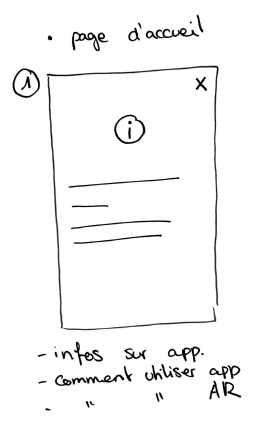
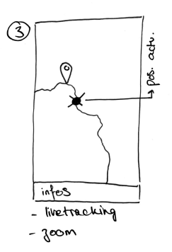
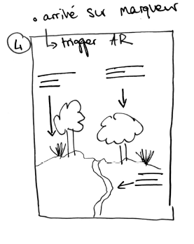

# L'utilisation de l'AR pour les sentiers didactiques

Ce projet est élaboré dans le cadre de mon mémoire à l'Université de Lausanne, sous la direction de Christian Kaiser.

L'idée principale du projet est de développer une application utilisant la réalité augmentée (AR) dans le cadre d'un sentier didactique, basé sur le géoguide de l'UNIL. Ce genre de géovisualisation permet de superposer du contenu virtuel supplémentaire sur la réalité afin d'augmenter la perception de l'utilisateur. Dans le cadre d'un sentier didactique, l'AR permettrait à l'utilisateur de se promener le long d'un parcours prédéfini. Lorsque l'utilisateur arriverait à un point donné (localisé sur la carte intéractive), il y aurait possibilité d'utiliser la caméra intégrée sur le smartphone afin d'obtenir des informations supplémentaires quant à tel ou tel lieux, en superposant directement ces informations aux objets concernés.

# Utilisation

Puisque cette application est une web app, il est primordial de pouvoir l'utiliser depuis son smartphone directement. Or, afin de visualiser les étapes en réalité augmentée, il est obligatoire de configure un protocol HTTPS.

Deux solutions s'offrent à nous: 

1) Déployer le github.pages de l'application à chaque changement. A chaque push que l'on effectue, GitHub met à disposition gratuitement une version hebergée de notre application à l'adresse https://theogerritsen.github.io/AR_project/ que nous pouvons ensuite ouvrir depuis notre smartphone.

    * Avantages : 
    
        * Service gratuit
        * Disponible à tout le monde via un lien unique

    * Inconvénients :

        * Lent: il est nécessaire de faire un commit à chaque changement dans le code pour vérifier si cela fonctionne. GitHub pages met environ 5 minutes à se déployer.
        
2) Déployer un serveur local HTTPS. Cette solution est plus difficile à mettre en place (puisqu'un serveur local utilise, de base, un protocol HTTP), mais beaucoup plus rapide une fois que cela est fait. Voici les étapes à suivre:

    * Installer Node.js
    * Installer un serveur local via Node.js dans notre dossier. Il faut naviguer jusqu'à notre dossier où se trouve notre fichier index.html avec la commande `cd {PATH_TO_FOLDER}` (remplacer {PATH_TO_FOLDER} par votre chemin d'accès). Une fois dans le bon dossier, il est possible d'installer un serveur local avec la commande `npm install http-server`
    *Installer Chocolatey si cela n'est pas déjà fait (normalement directement installé avec Node.js)
    * Installer mkcert avec la commande `choco install mkcert`
    * Générer un certificat d'autorité dans notre dossier avec la commande `mkcert -install`, puis `mkcert localhost`. Deux nouveaux fichiers sont alors créés dans le dossier: `localhost.pem` et `localhost-key.pem`. Ces certificats nous permettent de déployer un serveur local avec un protocol HTTPS.
    * Déployer notre serveur local HTTPS avec la commande `http-server -S -C localhost.pem -K localhost-key.pem`. `-S` déploye le serveur avec HTTPS, `-C` utilise le certificat et ^-K` la clé.
    * Un message est ensuite visible: 
    
    ```Available on:
    https://xxx.xxx.x.xx:8080

    https://xxx.xxx.xx.x:8080

    https://xxx.x.x.x:8080```

    qui nous indique que notre serveur local HTTPS a bien été lancé. Les xxx correspondent à votre adresse IP.
    * Pour tester l'application sur notre smartphone, il faut tout d'abord aller récupérer notre adresse IP, qui peut se faire avec la commande `ipconfig` dans le terminal. Prenez l'adresse IPv4, qui devrait correspondre à la première adresse générée lors de l'étape précédente. Si les deux correspondent, connectez votre smartphone au même wifi que votre ordinateur, et tapez `https://{votre adresse IPv4}:8080`
    * Il est maintenant possible d'utiliser l'application directement avec votre smartphone.


# Etat de l'art

## Articles

# Outils utilisés

## AR.js

L'outil principal utilisé ici sera la bibliothèque AR.js, une bibliothèque JavaScript open source, développée en 2017, qui permet d'intégrer de la réalité augmentée directement dans une application web. Elle permet de développer une application AR en utilisant soit la détection d'image, la localisation de l'utilisateur ou encore la détection d'un marqueur prédifini. Il est possible de développer une application hybride qui utilise plusieurs de ces méthodes.
Nous allons ici surtout nous concentrer sur deux méthodes:

* [Location based](https://ar-js-org.github.io/AR.js-Docs/location-based/): cette méthode repose sur les coordonnées GPS de l'utilisateur afin d'afficher des informations géolocalisées. C'est la fonctionalité principale de notre application puisqu'il s'agit d'un sentier didactique qu'il faut suivre étape par étape. Il est possibole de géolocaliser des objets en trois dimensions (souvent en format gltf généré dans des logiciels 3D comme blender, ou créer directement avec a-frame) qui seront visibles à l'utilisateur. C'est une méthode robuste mais qui repose sur la précision de géolocalisation et des différents capteurs des smartphones. Certains objets peuvent être donc décalés par rapport à ce qui était prévu si la géolocalisation de l'utilisateur n'est pas assez précise.

* [Image tracking](https://ar-js-org.github.io/AR.js-Docs/image-tracking/): cette méthode repose sur la reconnaissance d'éléments visuels sur une image afin d'afficher des objets en 3D par dessus cette image. La première étape est de choisir une image de bonne qualité avec des détails reconnaissable (contrastée par exemple). Il faut ensuite générer des points clés (Image Descriptor) de cette image que la caméra pourra ensuite reconnaître afin de superposer la réalité augmentée par dessus cette image. Cette étape se fait par le biai d'un NFT Marker Creator. Il existe une version web pour convertir l'image en NFT, mais elle est un peu bancale et très lente. La solution plus rapide est d'utiliser la version Node.js. Il faut tout d'abord clôner [ce repo](https://github.com/Carnaux/NFT-Marker-Creator), installer les dépendances avec la commande `npm install` (dans le dossier principal). Une fois l'installation terminée, il faut déplacer l'image choisie dans le dossier de l'application (dans un sous-dossier *image* par exemple). Il est ensuite possible de générer l'Image Descriptor en utilisant la commande `node app.js -i {image.png} -dpi=300`. La commande `-dpi=300` rendra le processus plus lent mais la détection d'image sera grandement facilitée par la suite. Une explication du DPI et comment cela fonctionne peut être trouvée [ici](https://monsieurecommerce.com/300-dpi-72-dpi-cest-quoi-des-dpi-et-comment-ca-marche-toute-la-verite/). L'application nous génère trois fichiers, les image descriptor,que nous pouvons utiliser par la suite.

    Une dernière chose importante pour la détection d'image est l'affectation des chemins d'accès du modèle gltf et des image descriptor dans notre code source. Comme indiqué [ici](https://github.com/AR-js-org/AR.js/issues/364) l'url du NFT (image descriptor) et l'url du modèle (gltf) ne sont pas géré de la même manière. En ce qui concerne le modèle gltf, il est possible de le récupérer via un chemin relatif simple (`ar_gltf/trex/scene.gltf` par exemple). En revanche, il est nécessaire d'avoir le nom du domaine web pour récupérer les NFT. Pour ne pas avoir de problème avec le *Cross-porigin-ressource-sharing* (CORS) qui bloquerait l'accès aux fichiers ne provenant pas de la même source, il faut aller chercher le fichier raw dans notre repo github, en y accédant puis en cliquant sur "View raw". Il faut ensuite, via l'extension web [RawGit fot Github](https://chrome.google.com/webstore/detail/rawgit-for-github/mobohgekahaknpfhiknjgepliebadkko?hl=sl), récupérer l'URL générée, ressemblant à  Il faut ensuite récupérer l'URL générée, ressemblant à `https://raw.githubusercontent.com/...` que nous pourrons finalement utiliser dans notre code.

* Une dernière méthode est proposée par AR.js que nous n'exploiterons pas ici : [Marker based](https://ar-js-org.github.io/AR.js-Docs/marker-based/). Cette méthode repose sur l'identification d'un marqueur (type QR code) afin d'afficher un élément en AR. Puisque notre application concerne un sentier didactique, il ne sera pas possible de disposer de marqueurs à travers la ville, même si cette dernière méthode est la plus fiable.

## A-Frame

[A-Frame](https://aframe.io/docs/1.3.0/introduction/) est un outil permettant de créer des expériences en réalité augmentée et en réalité virtuelle. Il s'agit d'un langage construit autours de l'HTML permettant de facilement créer des objets en trois dimensions à l'aide de différentes balises pré-définies.

## Applications AR déjà réalisée

### Pour les sentiers didactiques en Suisse

[Carcatchou](https://carcatchou.cn-froideville.ch/desktop.html) est une ballade à Froideville qui offre une expérience en réalité augmentée sur le thème de l'espace.

[Totemi](https://totemi.ch/news/un-sentier-didactique-autour-dun-biotope/) est une application mobile qui permet à l'utilisateur une expérience en réalité augmentée autours de différents sujets et à différents endroits.

[Novilé](https://www.fribourgregion.ch/fr/la-gruyere/sport-plein-air/novile-lac-de-la-gruyere-en-realite-augmentee/) une chasse aux trésors en réalité augmentée autours du Lac de Gruyère.

[StoriaBox](https://www.loisirs.ch/loisirs/21386/storiabox-castrum-d-yverdon) redonne vie au Castrum d'Yverdon en 3D.

### Autres applications en Réalité Augmentée

#### Education

[Complete Anatomy '21](https://apps.apple.com/app/complete-anatomy-platform-20/id1309253074?ls=1&mt=8) permet d'apprendre l'anatomie du corps humain en AR

[Sky Guide](https://apps.apple.com/app/sky-guide/id576588894?ls=1&mt=8) permet d'explorer le ciel nocturne et apprendre sur les étoiles qui nous entourent

[Physics Lab AR](https://apps.apple.com/app/physics-lab-ar/id1298984261?ls=1&mt=8) est une application permettant de faire des expériences scientifiques en AR

[PlantSnap: plant identifier](https://apps.apple.com/app/plantsnap-plant-identifier/id1451054346?ls=1&mt=8), [PlantNet](https://apps.apple.com/ch/app/plantnet/id600547573?l=fr) et [PictureThis](https://apps.apple.com/us/app/picturethis-plant-identifier/id1252497129) sont des applications permettant d'identifier diverses plantes avec une UI en AR.

#### Pratique

[AdobeScan](https://apps.apple.com/ch/app/adobe-scan-scanner-ocr-de-pdf/id1199564834?l=fr) permet de scanner des documents et de les exporter en format PDF en utilisant une UI en AR.

[Google Translate](https://apps.apple.com/us/app/google-translate/id414706506) possède une fonctionalité qui permet de traduire en temps réel un texte que l'on capture à la caméra. L'application supperposera alors la traduction en utilisant la police appropriée.

[IKEA Place](highlights.ikea.com/2017/ikea-place/) permet de visualiser les articles d'IKEA directement dans son appartement en utilisant l'AR

# Web App

Nous avons choisi de développer cette application directement sur le web, car cela présente plusieurs avantages : 

*
*
*

## Croquis de développement









